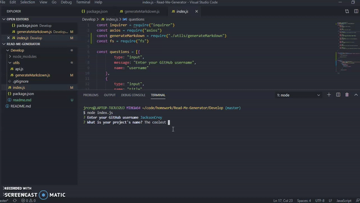

# Read-Me-Generator

# Description
```
The Read me Generator uses Axios, and inquirer to prompt the user the array of questions within the terminal. Then it takes in the users responses to the questions, as wells as pulls the users Bio, and Email which is coming back as Null even though it is set up correctly.
```

# Video Of Usage 


